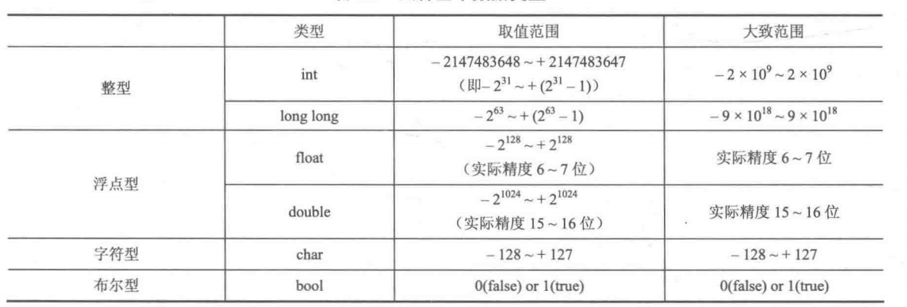
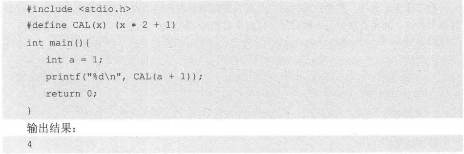

# 基础知识  
#### 常见变量 



**注**：```unsigned```相当于出去了一位的符号数，所以会乘以2  
##### 浮点数  
对于浮点数精度来说 ```double``` > ```float``` ，尽量不要使用```float```  
##### 波尔型
c++中波尔变量需要依赖于```#include<stdbool.h>```,值得注意的是，**整数** 型变量被赋值给波尔型变量的时候，无论是-1还是1，都会被认为是 ```true```，只有0会被认为是```false```.  
##### 常量的定义
``` c
#include<stdio.h>
#define pi 3.14
const double pi1 =3.14;
int main(){
    printf("%f",pi);
    printf("%f",pi1);
    return 0;
}
```
如上为两种定义的方式，值得注意的是利用对于 ```define```是不需要添加分号的，而const则需要添加引号，同时，需要我们关注的是两者都是写在引号的外边的。



注：如上图所示，我们在定义的时候最好将每个变量都带上括号，防止错误的发生。
正确写法：

```c++
#define CAL(x) ((x)*2+1)
```

##### 
