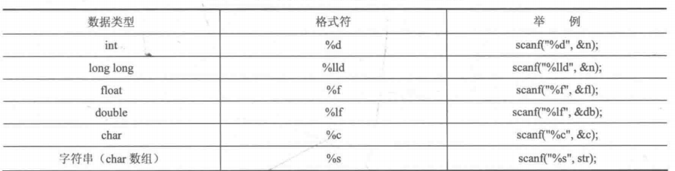
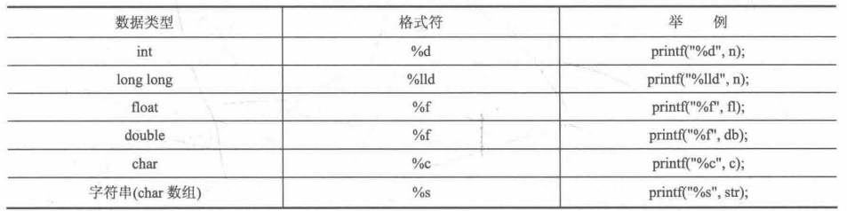

# 基础知识  
#### 常见变量 


**注**：```unsigned```相当于出去了一位的符号数，所以会乘以2  
##### 浮点数  
对于浮点数精度来说 ```double``` > ```float``` ，尽量不要使用```float```  
##### 波尔型
c++中波尔变量需要依赖于```#include<stdbool.h>```,值得注意的是，**整数** 型变量被赋值给波尔型变量的时候，无论是-1还是1，都会被认为是 ```true```，只有0会被认为是```false```.  
##### 常量的定义
``` c
#include<stdio.h>
#define pi 3.14
const double pi1 =3.14;
int main(){
    printf("%f",pi);
    printf("%f",pi1);
    return 0;
}
```
如上为两种定义的方式，值得注意的是利用对于 ```define```是不需要添加分号的，而const则需要添加引号，同时，需要我们关注的是两者都是写在引号的外边的。


注：如上图所示，我们在定义的时候最好将每个变量都带上括号，防止错误的发生。
正确写法：

```c++
#define CAL(x) ((x)*2+1)
```

#### 运算符

##### 条件运算符
```c++
A?B:C;
//如果A为true，则选择B，否则选择C
//例：
int c =a>b ? 7:11;

# define MAX(a,b)((a)>(b)?(a):(b))
```
##### 位运算符
对于程序中的**无穷大数**可以设置为：
```c++
const int INF = (1<<30)-1;
const int INF = 0x3fffffff;
```
##### scanf 和printf
相较于cpp，其速度会相对较快一些
对应的输入格式如下：

**注**：数组名称本身代表这个数组第一个元素的地址，不需要 **&**，其他都是需要的。
对于```13:45:20```,这种类型的输入可以直接使用如下方法进行录入：
```c++
int hh,mm,ss;
scanf("%d:%d:%d",&hh,&mm,&ss);
```
**注**：
* scanf 的输入是按照**空白符（空格、Tab)** 为结束判断标志的（除了 **%c**，其会读取空格)

```c++
 //输入3 4
 int a,b;
 scanf("%d%d",&a,&b);
```

*  **%s**字符串数组按照空格跟换行符为读入结束的标志


```c++
int a; char c, str[10];
scanf("%d%c%s",&a,&c,str);
//输入 
1 a asd
//输出
a=1 , c= ,str=a
```
对应的输出格式：


注：double在输入的时候为%lf ,在输出的时候则变成了 %f

###### 常用输出格式
1.  ```%md```：
    - 不足m位则向右补齐，如果大于m位则不变
    ```c++
    printf("%5d")
    123//<-3和5对其了
    12345678
    ```
2.  ```%0md``` ：
    - 相较于上边，不够位进行补零操作
```c++
printf("%05d")
00123//<-3和5对其了
12345678
```
3. ```%.mf```:
   -保留xx小数点，精确到小数点后多少位


##### typedef

将复杂的数据类型重新命名

```c++
typedef long long LL; 
```
#### 常用的引用
##### math.h

1. ```fab(double x)``` 取绝对值
2. ```floor(double x)和 ceil(double x)```分别是向下和向上取整。
    - floor(-5.2 5.2） --> -6 5
    - ceil(-5.2 5.2） --> -5 6
3. ```pow(double r,double p)``` 返回r的p次方的值
4. ```sqrt(double x)```算数平凡根（正数）
5. ```log(double x)``` , ln，c语言没有求其他为底对数的方法，所以需要利用换底公式
6. ```sin,cos,tan(double x)``` x,为弧度制 pi/2
7. ``` asin,acos,atan(double x)``` 反三角函数
8. ```round(double x)```,四舍五入求整数
9. 